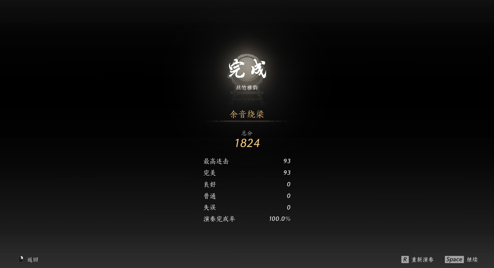
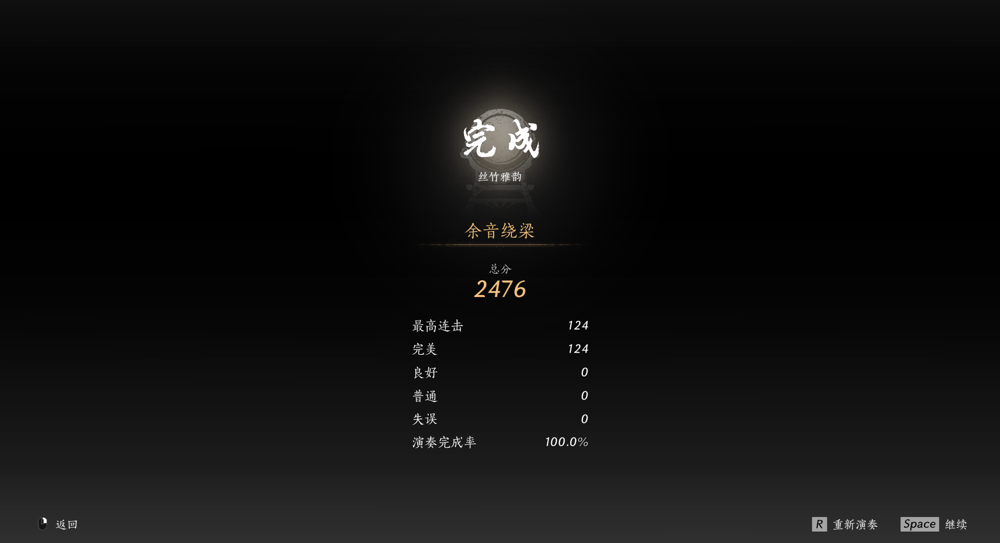

# 烟云十六声-丝竹雅韵 AI演奏机器人（非外挂）

基于 **YOLOv11** 训练的烟云十六声 AI 演奏机器人。

---

## 前置条件

1. 目前仅适用于 **烟云十六声 PC 版**，分辨率为 1920×1080  
2. 本程序运行在 **独立电脑** 上，不在游戏电脑中运行，因此需要 **两台电脑**  
3. 本项目通过 **MS2131 采集卡** 对显示器内容进行采集，也可以通过 **固定摄像头** 进行采集  
4. 本项目通过 **CH0329 USB 串口键盘** 对目标电脑进行操作  

**注：**  
- 电脑性能不能太低，可以通过 `-sp true` 进行预览，如果 FPS 低于 30，将影响使用体验  
- MS2131 采集卡（环出），拼多多 36 元购入  
- CH0329 串口键盘（双 USB 口），淘宝 16 元购入  

---

## 运行参数

| 参数 | 说明 |
|------|------|
| `-h`, `--help` | 显示帮助信息并退出 |
| `-kp`, `--kbms_port` | 键盘端口号 |
| `-ci`, `--camera_index` | 摄像头索引 |
| `-sp`, `--screen` | 显示检测窗口 |
| `-lg`, `--log` | 启用日志记录 |
| `-cw`, `--CAP_WIDTH` | 采集宽度 |
| `-ch`, `--CAP_HEIGHT` | 采集高度 |
| `-cf`, `--CAP_FPS` | 采集帧率 |

---

## 目前的问题

1. CH0329 **不能单独控制按键抬起**，因此放弃了 `keyup` 操作；如果没有正常退出，会导致按键无法抬起  
2. 模型仅训练了 **300 轮**，精度仍不足  
---

## 运行方法

1. pip install requirements.txt
2. python yysls.py
---

## 图片展示
金缕衣
  
坐观云水
  

---

*2025/9/14 by youkai*
